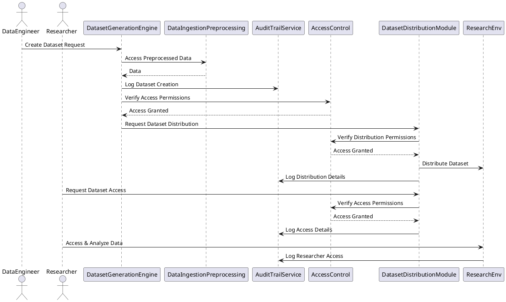

```asciidoc
= SPEC-001: Dataset Generation and Distribution Orchestration System
:sectnums:
:toc:


== Background

The healthcare sector is increasingly relying on data-driven research to advance medical knowledge and patient care.
To support these efforts, a system is required to orchestrate the generation of structured datasets from a unified data model of healthcare data,
where some preprocessing has already taken place. This system will facilitate the secure distribution of these datasets to authorized
research environments and ensure that a comprehensive audit trail is maintained for regulatory compliance and transparency.

This system will primarily serve two types of users: data engineers, who are responsible for dataset generation,
and academic researchers, who will use the datasets for analysis.
Initially, the system will support 10 data engineers and 100 researchers.

== Requirements

*Must Have*
- The system must generate structured datasets from a unified data model of healthcare data, leveraging preprocessed data.
- The system must provide role-based access control, limiting dataset access to authorized users (data engineers and researchers).
- The system must maintain detailed audit trails, including metadata such as:
  - Software versions used for dataset generation.
  - User information (who created the dataset, who accessed it).
  - Timestamps (when the dataset was created, modified, accessed).
  - Purpose of dataset creation and distribution.
  - Dataset distribution logs (where the data was sent, why, and to whom).
- The system must be scalable to handle large datasets.

*Should Have*
- The system should provide an interface for data engineers to manage the dataset generation process.
- The system should support logging and monitoring for operational visibility.

*Could Have*
- The system could integrate with existing data storage solutions.
- The system could support automated notifications when datasets are distributed.

*Won't Have*
- Data encryption is not required at this stage.

== Method

### Key Components
1. **Data Ingestion and Preprocessing Module**
2. **Dataset Generation Engine**
3. **Access Control and Authentication**
4. **Audit Trail and Logging Service**
5. **Dataset Distribution Module**
6. **User Interface**
7. **Monitoring and Alerting**

### Proposed Architecture Diagram



### Database Schema

- **Users**
  - `user_id` (Primary Key)
  - `username`
  - `role` (e.g., Data Engineer, Researcher)
  - `last_login`

- **Datasets**
  - `dataset_id` (Primary Key)
  - `created_by` (Foreign Key to Users)
  - `created_at`
  - `software_version`
  - `data_source` (Reference to preprocessed data model)
  - `purpose`

- **AuditLogs**
  - `log_id` (Primary Key)
  - `user_id` (Foreign Key to Users)
  - `action` (e.g., created, accessed, modified, analyzed)
  - `dataset_id` (Foreign Key to Datasets)
  - `timestamp`
  - `details`

- **DistributionLogs**
  - `distribution_id` (Primary Key)
  - `dataset_id` (Foreign Key to Datasets)
  - `distributed_to` (Foreign Key to Users or Research Environment)
  - `distributed_at`
  - `purpose`

== Implementation

=== Step 1: Set Up the Development Environment
- Provision necessary development and staging environments.
- Install required software and libraries (e.g., databases, web frameworks, authentication libraries).

=== Step 2: Build the Data Ingestion and Preprocessing Module
- Integrate with the existing unified data model.
- Implement data retrieval and preprocessing routines.
- Ensure compatibility with the Dataset Generation Engine.

=== Step 3: Develop the Dataset Generation Engine
- Implement dataset generation logic using the preprocessed data.
- Incorporate options for configuring dataset parameters (e.g., filters, aggregation).
- Integrate logging to the Audit Trail Service for every dataset creation event.

=== Step 4: Implement Access Control and Authentication
- Set up user authentication mechanisms (e.g., OAuth2, JWT).
- Develop role-based access control (RBAC) mechanisms to enforce permissions.
- Integrate with the Dataset Generation Engine and Dataset Distribution Module.

=== Step 5: Develop the Audit Trail and Logging Service
- Create a central logging service to track all system actions.
- Implement logging of dataset creation, access, and distribution events.
- Ensure logs are immutable and securely stored.

=== Step 6: Build the Dataset Distribution Module
- Develop functionality to distribute datasets to secure research environments.
- Integrate with the Access Control system to verify permissions before distribution.
- Log all distribution activities to the Audit Trail.

=== Step 7: Develop the User Interface
- Build a web-based interface for data engineers to manage dataset generation.
- Create a portal for researchers to request and access datasets.
- Ensure all actions taken via the UI are logged appropriately.

=== Step 8: Set Up Monitoring and Alerting
- Implement monitoring tools to track system performance and availability.
- Set up alerting mechanisms to notify administrators of any issues or suspicious activity.
- Ensure that all alerts are integrated with the logging service for auditing.

=== Step 9: Testing and Quality Assurance
- Perform unit testing of each module to ensure individual functionality.
- Conduct integration testing to verify the interaction between components.
- Carry out user acceptance testing (UAT) with a sample group of data engineers and researchers.

=== Step 10: Deployment and User Training
- Deploy the system in a production environment.
- Provide training sessions for data engineers and researchers on how to use the system.
- Monitor initial usage to quickly address any issues.

=== Step 11: Post-Deployment Monitoring and Maintenance
- Continuously monitor the system for performance and security.
- Regularly update the system to address any bugs or incorporate new features.
- Maintain the audit trail for compliance purposes.

== Milestones

1. **Milestone 1: Development Environment Setup**
   - Completion Criteria: All necessary environments and tools are installed and configured.
   - Estimated Time: 1 week

2. **Milestone 2: Data Ingestion and Preprocessing Module**
   - Completion Criteria: Module integrated with the unified data model and data is successfully retrieved and preprocessed.
   - Estimated Time: 2 weeks

3. **Milestone 3: Dataset Generation Engine**
   - Completion Criteria: Dataset generation logic is implemented, and datasets can be created from preprocessed data.
   - Estimated Time: 3 weeks

4. **Milestone 4: Access Control and Authentication**
   - Completion Criteria: Role-based access control and authentication mechanisms are fully operational.
   - Estimated Time: 2 weeks

5. **Milestone 5: Audit Trail and Logging Service**
   - Completion Criteria: Logging service is capturing all relevant actions and events, with secure storage in place.
   - Estimated Time: 2 weeks

6. **Milestone 6: Dataset Distribution Module**
   - Completion Criteria: Datasets can be distributed to secure research environments, with all activities logged.
   - Estimated Time: 2 weeks

7. **Milestone 7: User Interface Development**
   - Completion Criteria: Web-based interfaces for both data engineers and researchers are functional and user-friendly.
   - Estimated Time: 3 weeks

8. **Milestone 8: Monitoring and Alerting Setup**
   - Completion Criteria: Monitoring tools are in place, and alerting mechanisms are fully operational.
   - Estimated Time: 1 week

9. **Milestone 9: Testing and Quality Assurance**
   - Completion Criteria: All modules have passed unit, integration, and user acceptance testing.
   - Estimated Time: 2 weeks

10. **Milestone 10: Deployment and User Training**
    - Completion Criteria: The system is live in the production environment, and users have been trained.
    - Estimated Time: 2 weeks

11. **Milestone 11: Post-Deployment Monitoring and Maintenance**
    - Completion Criteria: System is being monitored, and any issues are addressed promptly.
    - Ongoing

== Gathering Results

After the system has been deployed, the following steps will be taken to evaluate its success:

1. **System Functionality Review**
   - Verify that the system meets all "Must Have" requirements as defined in the Requirements section.
   - Ensure that datasets are being generated and distributed correctly and securely.

2. **User Feedback Collection**
   - Gather feedback from data engineers and researchers to assess the usability and effectiveness of the system.
   - Address any issues or suggestions for improvement.

3. **Audit Trail Verification**
   - Review the audit logs to confirm that all actions are being properly recorded and stored.
   - Ensure that the logs are tamper-proof and meet compliance standards.

4. **Performance Analysis**
   - Monitor the system's performance, particularly in terms of data processing speed and system uptime.
   - Identify any bottlenecks or performance issues that need to be addressed.

5. **Security and Access Control Review**
   - Confirm that role-based access control is working as intended and that unauthorized access is prevented.
   - Review the security posture of the system and plan for any necessary improvements.

6. **Scalability Test**
   - Test the system’s ability to handle increased data loads and more users as the number of researchers grows.
   - Plan for future scaling if required.

7. **Final Report**
   - Compile a final report summarizing the system's performance, user feedback, and any necessary improvements.
   - Outline next steps and future enhancements.

```
